# Mermaid Diagrams for CodeMaster-3 (UniLearn) Documentation

This file contains all Mermaid diagram code based on the ACTUAL implementation of the CodeMaster-3 project. Generate these diagrams using a Mermaid renderer (https://mermaid.live/) and insert the generated images into the main documentation.

---

## Diagram 1: Actual System Architecture
**Location:** Chapter 5.1 - System Architecture Overview

```mermaid
graph TB
    subgraph "Client Layer"
        Browser[Web Browser]
        Mobile[Mobile Device]
    end

    subgraph "Presentation Layer - Views"
        EJS[EJS Templates]
        Partials[Partials: header/footer]
        Pages[Pages: index/dashboard/courses]
        CSS[Custom CSS + Dark Mode]
        ClientJS[Client JS: avatar-helper/darkmode/login]
    end

    subgraph "Application Layer - Express Server server.js"
        Routes[Routes]
        Controllers[Controllers]
        Middleware[Middleware]
        Models[Models]
        Services[Services]
    end

    subgraph "Routes Layer server/routes/"
        AuthRoutes[authRoutes.js]
        UserRoutes[userRoutes.js]
        CourseRoutes[courseRoutes.js]
        LessonRoutes[lessonRoutes.js]
        QuizRoutes[quizRoutes.js]
        QuestionRoutes[questionRoutes.js]
        GradeRoutes[gradeRoutes.js]
        PaymentRoutes[paymentRoutes.js]
        OrderRoutes[orderRoutes.js]
        CertificateRoutes[certificateRoutes.js]
        ProgressRoutes[progressRoutes.js]
        CommunityRoutes[communityRoutes.js]
        GroupRoutes[groupRoutes.js]
        BlogRoutes[blogRoutes.js]
        UploadRoutes[uploadRoutes.js]
    end

    subgraph "Controllers Layer server/controllers/"
        AuthController[authController.js]
        UserController[userController.js]
        CourseController[courseController.js]
        LessonController[lessonController.js]
        QuizController[quizController.js]
        QuestionController[questionController.js]
        GradeController[gradeController.js]
        PaymentController[paymentController.js]
        OrderController[orderController.js]
        CertificateController[certificateController.js]
        ProgressController[progressController.js]
        CommunityController[communityController.js]
        GroupController[groupController.js]
        BlogController[blogController.js]
        UploadController[uploadController.js]
    end

    subgraph "Middleware server/middleware/"
        AuthMiddleware[authMiddleware.js<br/>JWT Verification]
        SubscriptionMiddleware[subscriptionMiddleware.js]
    end

    subgraph "Models Layer server/models/"
        UserModel[User.js]
        CourseModel[Course.js]
        LessonModel[Lesson.js]
        QuizModel[Quiz.js]
        QuestionModel[Question.js]
        GradeModel[Grade.js]
        OrderModel[Order.js]
        PaymentModel[Payment.js]
        EnrollmentModel[Enrollment.js]
        CertificateModel[Certificate.js]
        ProgressModel[Progress.js]
        SubscriptionModel[Subscription.js]
        BlogModel[Blog.js]
        GroupModel[Group.js]
    end

    subgraph "External Services"
        GoogleOAuth[Google OAuth 2.0<br/>via Passport.js]
        Stripe[Stripe Payment API]
        Cloudinary[Cloudinary CDN<br/>Image/Video Upload]
        NodeMailer[NodeMailer<br/>Email Service]
    end

    subgraph "Data Layer"
        Firestore[(Firebase Firestore<br/>NoSQL Database)]
    end

    subgraph "Configuration server/config/"
        PassportConfig[passport.js]
        CloudinaryConfig[cloudinary.js]
    end

    Browser --> EJS
    Mobile --> EJS
    EJS --> Pages
    EJS --> Partials
    Pages --> ClientJS
    Pages --> CSS
    ClientJS --> Routes

    Routes --> AuthRoutes
    Routes --> UserRoutes
    Routes --> CourseRoutes
    Routes --> PaymentRoutes

    AuthRoutes --> AuthController
    UserRoutes --> UserController
    CourseRoutes --> CourseController
    PaymentRoutes --> PaymentController

    AuthController --> AuthMiddleware
    UserController --> AuthMiddleware
    CourseController --> SubscriptionMiddleware

    AuthController --> UserModel
    CourseController --> CourseModel
    PaymentController --> PaymentModel

    UserModel --> Firestore
    CourseModel --> Firestore
    PaymentModel --> Firestore

    PassportConfig --> GoogleOAuth
    CloudinaryConfig --> Cloudinary
    PaymentController --> Stripe
    AuthController --> NodeMailer

    style Firestore fill:#fff4e6
    style GoogleOAuth fill:#e8f5e9
    style Stripe fill:#f3e5f5
    style Cloudinary fill:#fce4ec
    style NodeMailer fill:#e1f5fe
```

---

## Diagram 2: Actual Database Schema (Firestore Collections)
**Location:** Chapter 5.2 - Database Design

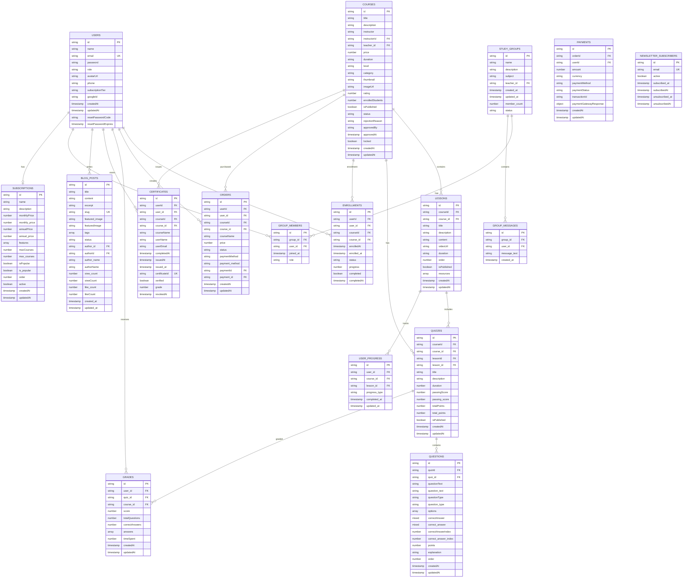

---

## Diagram 3: Authentication Flow (Google OAuth + JWT)
**Location:** Chapter 2.4.1 - OAuth 2.0 Protocol & Chapter 5.5 - Security Architecture

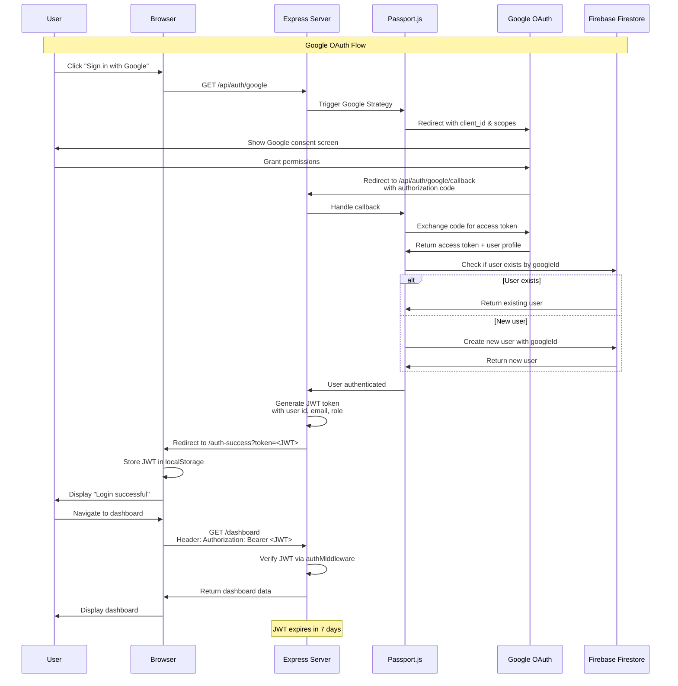

---

## Diagram 4: Email/Password Authentication Flow
**Location:** Chapter 5.5 - Security Architecture

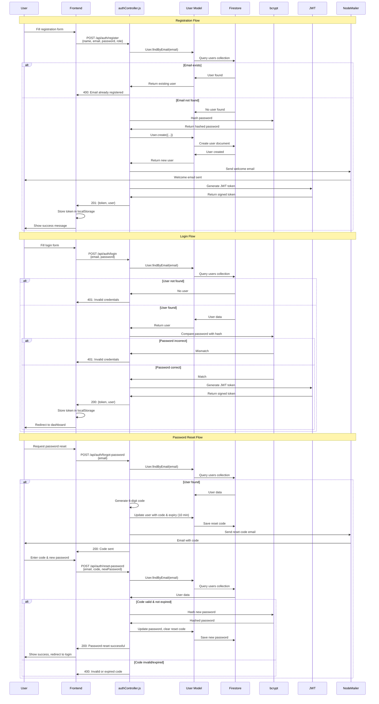

---

## Diagram 5: Stripe Payment Integration Flow
**Location:** Chapter 2.5.1 - Stripe Payment Platform & Chapter 6.4 - Third-Party Integration

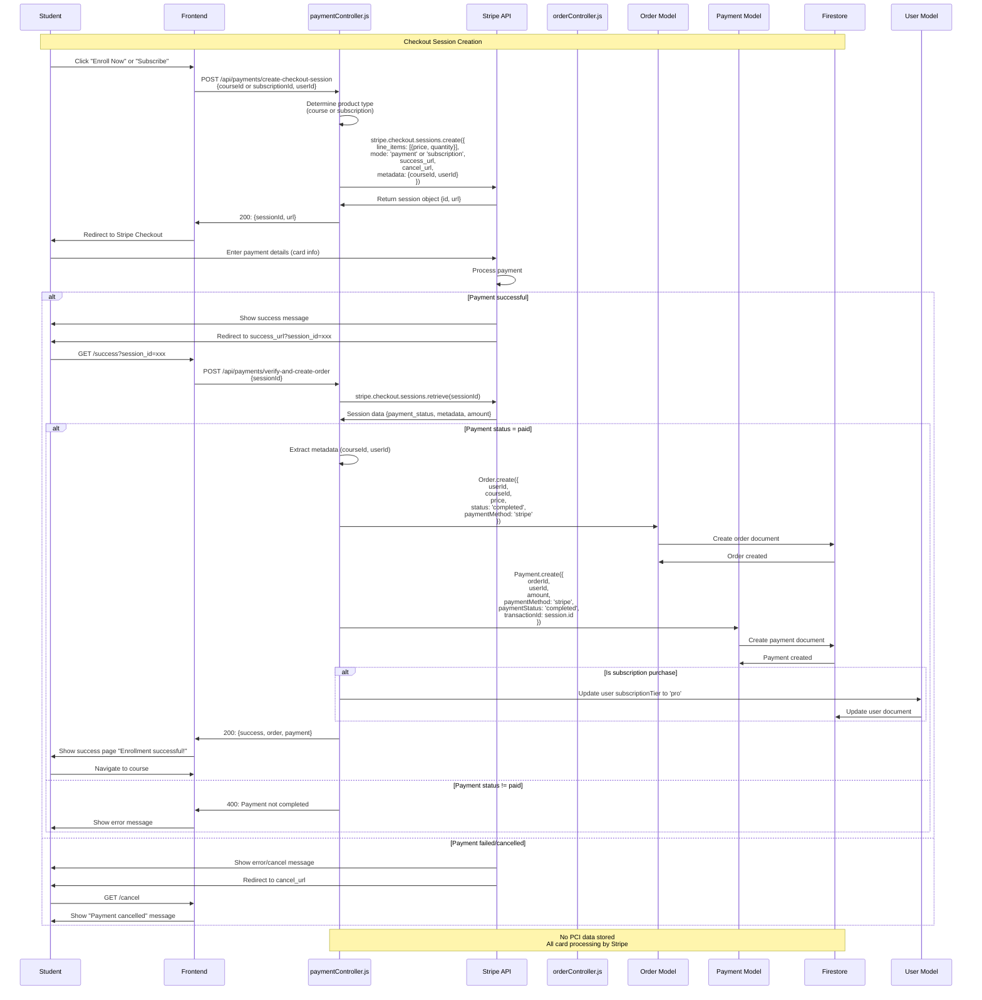

---

## Diagram 6: Cloudinary Image Upload Flow
**Location:** Chapter 2.6.2 - Cloudinary CDN & Chapter 6.4 - Third-Party Integration

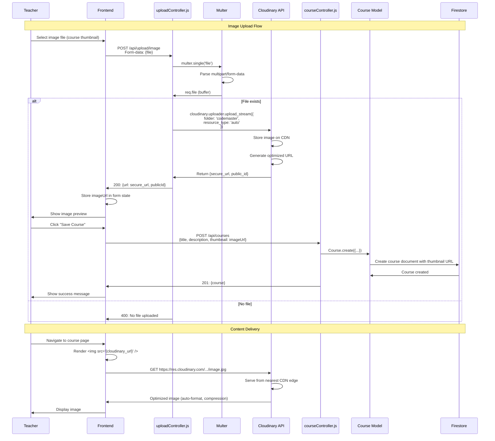

---

## Diagram 7: Course Enrollment & Progress Tracking Flow
**Location:** Chapter 4.3 - Use Cases and User Stories

```mermaid
flowchart TD
    Start([Student browses courses]) --> ViewCourse[Click on course card]
    ViewCourse --> CourseDetail[View course details page]
    CourseDetail --> CheckEnrolled{Already enrolled?}

    CheckEnrolled -->|Yes| GoToLearning[Redirect to My Learning]
    CheckEnrolled -->|No| CheckPrice{Is course free?}

    CheckPrice -->|Yes| EnrollFree[Click "Enroll for Free"]
    CheckPrice -->|No| CheckPurchased{Already purchased?}

    CheckPurchased -->|Yes| EnrollFree
    CheckPurchased -->|No| GoToCheckout[Click "Enroll Now"]

    GoToCheckout --> StripePayment[Stripe Checkout]
    StripePayment --> PaymentSuccess{Payment successful?}

    PaymentSuccess -->|No| CourseDetail
    PaymentSuccess -->|Yes| CreateOrder[Create Order & Payment records]

    CreateOrder --> CreateEnrollment[Create Enrollment record]
    EnrollFree --> CreateEnrollment

    CreateEnrollment --> MyLearning[Go to My Learning page]
    GoToLearning --> MyLearning

    MyLearning --> SelectCourse[Select enrolled course]
    SelectCourse --> LessonList[View lesson list]
    LessonList --> SelectLesson[Click on lesson]

    SelectLesson --> ViewLesson[View lesson content]
    ViewLesson --> WatchVideo{Has video?}

    WatchVideo -->|Yes| PlayVideo[Play video]
    WatchVideo -->|No| ReadContent[Read text content]

    PlayVideo --> CompleteLesson[Mark lesson as complete]
    ReadContent --> CompleteLesson

    CompleteLesson --> UpdateProgress[Update user_progress collection]
    UpdateProgress --> UpdateEnrollment[Update enrollment progress %]
    UpdateEnrollment --> HasQuiz{Lesson has quiz?}

    HasQuiz -->|Yes| TakeQuiz[Take quiz]
    HasQuiz -->|No| MoreLessons{More lessons?}

    TakeQuiz --> SubmitQuiz[Submit quiz answers]
    SubmitQuiz --> GradeQuiz[System grades quiz]
    GradeQuiz --> SaveGrade[Save grade to Firestore]
    SaveGrade --> CheckPassing{Score >= passing?}

    CheckPassing -->|No| ShowResults[Show results - Failed]
    CheckPassing -->|Yes| MarkPassed[Mark quiz as passed]

    MarkPassed --> ShowResults[Show results - Passed]
    ShowResults --> MoreLessons

    MoreLessons -->|Yes| LessonList
    MoreLessons -->|No| CheckComplete{All lessons + quizzes complete?}

    CheckComplete -->|No| LessonList
    CheckComplete -->|Yes| GenerateCert[Generate certificate]

    GenerateCert --> SaveCert[Save to certificates collection]
    SaveCert --> UpdateEnrollmentComplete[Mark enrollment as completed]
    UpdateEnrollmentComplete --> ShowCert[Display certificate]
    ShowCert --> End([Certificate awarded!])

    style Start fill:#e3f2fd
    style EnrollFree fill:#c8e6c9
    style StripePayment fill:#fff9c4
    style CompleteLesson fill:#b2dfdb
    style GenerateCert fill:#ce93d8
    style ShowCert fill:#ce93d8
    style End fill:#a5d6a7
```

---

## Diagram 8: Quiz Creation & Grading System
**Location:** Chapter 6.2 - Backend Implementation

```mermaid
flowchart TD
    Start([Teacher Dashboard]) --> SelectCourse[Select course]
    SelectCourse --> QuizMgmt[Go to Quiz Management]
    QuizMgmt --> CreateQuiz[Click "Create Quiz"]

    CreateQuiz --> QuizForm[Fill quiz details]
    QuizForm --> |Title, description, duration| SetPassing[Set passing score %]
    SetPassing --> SaveQuiz[Save quiz to Firestore]
    SaveQuiz --> AddQuestions[Add questions]

    AddQuestions --> QuestionForm[Create question form]
    QuestionForm --> EnterQuestion[Enter question text]
    EnterQuestion --> SelectType{Question type}

    SelectType --> MultipleChoice[Multiple Choice]
    MultipleChoice --> AddOptions[Add 4 options]
    AddOptions --> SelectCorrect[Select correct answer index]
    SelectCorrect --> SetPoints[Set points for question]
    SetPoints --> AddExplanation[Add explanation optional]
    AddExplanation --> SaveQuestion[Save to questions collection]

    SaveQuestion --> MoreQuestions{Add more questions?}
    MoreQuestions -->|Yes| QuestionForm
    MoreQuestions -->|No| CalcTotal[Calculate totalPoints]
    CalcTotal --> UpdateQuiz[Update quiz totalPoints]
    UpdateQuiz --> PublishQuiz[Publish quiz]
    PublishQuiz --> TeacherEnd([Quiz ready!])

    %% Student Taking Quiz

    StudentStart([Student in lesson]) --> ViewQuiz[See quiz available]
    ViewQuiz --> StartQuiz[Click "Start Quiz"]
    StartQuiz --> LoadQuestions[Load all questions from Firestore]
    LoadQuestions --> DisplayQ[Display question by question]

    DisplayQ --> StudentAnswer[Student selects answer]
    StudentAnswer --> NextQ{More questions?}
    NextQ -->|Yes| DisplayQ
    NextQ -->|No| SubmitAnswers[Submit all answers]

    SubmitAnswers --> GradeController[gradeController.js]
    GradeController --> FetchQuiz[Fetch quiz data]
    FetchQuiz --> FetchQuestions[Fetch all questions]
    FetchQuestions --> InitScore[Initialize score = 0]

    InitScore --> LoopQuestions[Loop through questions]
    LoopQuestions --> CompareAnswer{Student answer = correct answer?}

    CompareAnswer -->|Yes| AddPoints[score += question.points]
    CompareAnswer -->|No| NoPoints[No points added]

    AddPoints --> NextQuestion{More questions?}
    NoPoints --> NextQuestion

    NextQuestion -->|Yes| LoopQuestions
    NextQuestion -->|No| CalcPercentage[percentage = score / totalPoints * 100]

    CalcPercentage --> CheckPass{percentage >= passingScore?}

    CheckPass -->|Yes| StatusPassed[status = 'passed']
    CheckPass -->|No| StatusFailed[status = 'failed']

    StatusPassed --> UpdateProgress[Update lesson progress]
    StatusFailed --> NoProgressUpdate[No progress update]

    UpdateProgress --> SaveGrade[Save grade record to Firestore]
    NoProgressUpdate --> SaveGrade

    SaveGrade --> CheckAllComplete{All course lessons complete?}

    CheckAllComplete -->|Yes| TriggerCert[Trigger certificate generation]
    CheckAllComplete -->|No| ShowResult[Show quiz results]

    TriggerCert --> ShowResult
    ShowResult --> StudentEnd([Student sees score & feedback])

    style CreateQuiz fill:#bbdefb
    style SaveQuiz fill:#c5e1a5
    style PublishQuiz fill:#a5d6a7
    style StartQuiz fill:#fff9c4
    style StatusPassed fill:#c8e6c9
    style StatusFailed fill:#ffcdd2
    style TriggerCert fill:#ce93d8
```

---

## Diagram 9: API Route Structure (Actual Routes)
**Location:** Chapter 5.3 - API Design

```mermaid
graph TB
    subgraph "Authentication API /api/auth"
        A1[POST /register]
        A2[POST /login]
        A3[POST /forgot-password]
        A4[POST /reset-password]
        A5[GET /google]
        A6[GET /google/callback]
    end

    subgraph "User API /api/users"
        U1[GET /]
        U2[GET /:id]
        U3[PUT /:id]
        U4[DELETE /:id]
    end

    subgraph "Course API /api/courses"
        C1[GET /]
        C2[GET /:id]
        C3[POST /]
        C4[PUT /:id]
        C5[DELETE /:id]
        C6[GET /teacher/:teacherId]
    end

    subgraph "Lesson API /api/lessons"
        L1[GET /]
        L2[GET /:id]
        L3[POST /]
        L4[PUT /:id]
        L5[DELETE /:id]
        L6[GET /course/:courseId]
    end

    subgraph "Quiz API /api/quizzes"
        Q1[GET /]
        Q2[GET /:id]
        Q3[POST /]
        Q4[PUT /:id]
        Q5[DELETE /:id]
        Q6[GET /course/:courseId]
        Q7[GET /lesson/:lessonId]
    end

    subgraph "Question API /api/questions"
        QU1[GET /]
        QU2[GET /:id]
        QU3[POST /]
        QU4[PUT /:id]
        QU5[DELETE /:id]
        QU6[GET /quiz/:quizId]
    end

    subgraph "Grade API /api/grades"
        G1[GET /]
        G2[GET /:id]
        G3[POST /]
        G4[GET /user/:userId]
        G5[GET /quiz/:quizId/user/:userId]
    end

    subgraph "Payment API /api/payments"
        P1[POST /create-checkout-session]
        P2[POST /verify-and-create-order]
        P3[GET /]
        P4[GET /:id]
    end

    subgraph "Order API /api/orders"
        O1[GET /]
        O2[GET /:id]
        O3[POST /]
        O4[GET /user/:userId]
    end

    subgraph "Certificate API /api/certificates"
        CE1[GET /]
        CE2[POST /generate]
        CE3[GET /:id]
        CE4[GET /verify/:certificateId]
        CE5[GET /user/:userId]
        CE6[GET /course/:courseId/user/:userId]
    end

    subgraph "Progress API /api/progress"
        PR1[GET /user/:userId]
        PR2[POST /lesson]
        PR3[GET /course/:courseId]
        PR4[GET /course/:courseId/user/:userId]
    end

    subgraph "Community API /api/community"
        CO1[GET /groups]
        CO2[POST /groups]
        CO3[GET /groups/:id]
        CO4[POST /groups/:id/join]
        CO5[GET /groups/:id/messages]
        CO6[POST /groups/:id/messages]
    end

    subgraph "Blog API /api/blog"
        B1[GET /]
        B2[GET /:id]
        B3[POST /]
        B4[PUT /:id]
        B5[DELETE /:id]
    end

    subgraph "Upload API /api/upload"
        UP1[POST /image]
        UP2[POST /video]
    end

    subgraph "Middleware Protection"
        AuthMW[authMiddleware.js<br/>JWT Verification]
        SubMW[subscriptionMiddleware.js<br/>Check Pro/Free tier]
    end

    AuthMW -.->|Protects| U1
    AuthMW -.->|Protects| C3
    AuthMW -.->|Protects| L3
    AuthMW -.->|Protects| Q3
    AuthMW -.->|Protects| G3
    AuthMW -.->|Protects| P1
    AuthMW -.->|Protects| CE2
    AuthMW -.->|Protects| PR2

    SubMW -.->|Checks tier| C2
    SubMW -.->|Checks tier| L2

    style AuthMW fill:#ffcdd2
    style SubMW fill:#f8bbd0
```

---

## Diagram 10: Security Architecture (Actual Implementation)
**Location:** Chapter 5.5 - Security Architecture

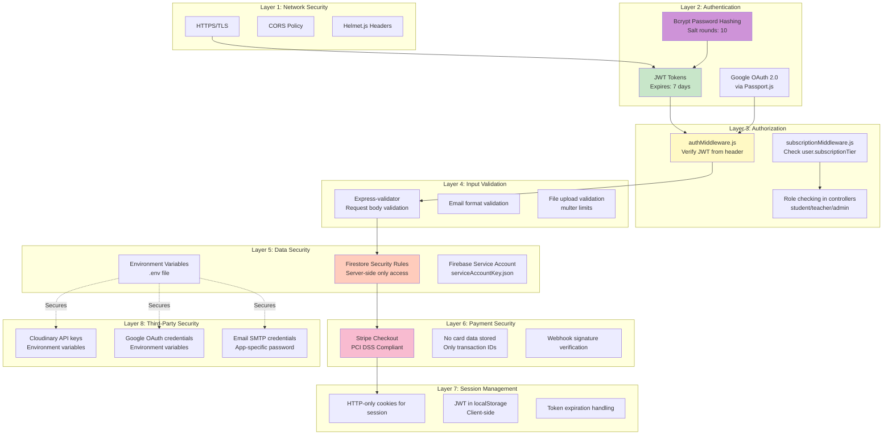

---

## Diagram 11: Subscription Tier System
**Location:** Chapter 2.5.3 - Subscription Billing Model

```mermaid
flowchart TB
    Start([New User Registration]) --> DefaultFree[Assign subscriptionTier = 'free']
    DefaultFree --> CheckEmail{Email domain?}

    CheckEmail -->|.edu/.ac.uk/.edu.vn| AutoPro[Auto-upgrade to 'pro']
    CheckEmail -->|Other| StayFree[Remain 'free']

    AutoPro --> Dashboard
    StayFree --> Dashboard[User Dashboard]

    Dashboard --> BrowseCourses[Browse courses]
    BrowseCourses --> SelectCourse[Select a course]
    SelectCourse --> CheckLocked{Course.locked == true?}

    CheckLocked -->|No - Free course| AllowEnroll[Allow enrollment]
    CheckLocked -->|Yes - Pro only| CheckUserTier{user.subscriptionTier?}

    CheckUserTier -->|'pro'| AllowEnroll
    CheckUserTier -->|'free'| BlockAccess[Block access]

    BlockAccess --> ShowUpgrade[Show "Upgrade to Pro" button]
    ShowUpgrade --> UserDecides{User clicks upgrade?}

    UserDecides -->|No| Dashboard
    UserDecides -->|Yes| StripeCheckout[Redirect to Stripe]

    StripeCheckout --> PaymentSuccess{Payment successful?}

    PaymentSuccess -->|No| Dashboard
    PaymentSuccess -->|Yes| UpdateUserTier[Update user.subscriptionTier = 'pro']

    UpdateUserTier --> CreateSubscriptionRecord[Create subscription record in Firestore]
    CreateSubscriptionRecord --> AllowEnroll

    AllowEnroll --> CreateEnrollment[Create enrollment]
    CreateEnrollment --> AccessCourse[Access course content]
    AccessCourse --> End([Learning!])

    style DefaultFree fill:#e0e0e0
    style AutoPro fill:#bbdefb
    style AllowEnroll fill:#c8e6c9
    style BlockAccess fill:#ffcdd2
    style UpdateUserTier fill:#ce93d8
    style AccessCourse fill:#a5d6a7
```

---

## Diagram 12: Teacher Course Management Workflow
**Location:** Chapter 4.3 - Use Cases and User Stories

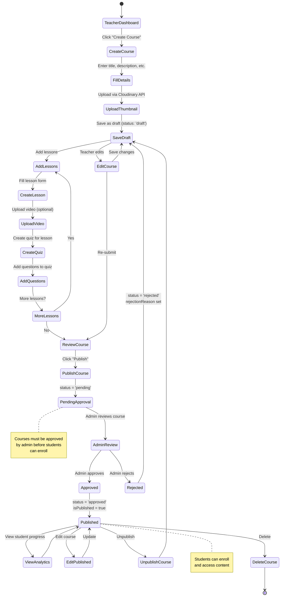

---

## Diagram 13: Deployment Pipeline (Vercel)
**Location:** Chapter 6.5 - Deployment Process

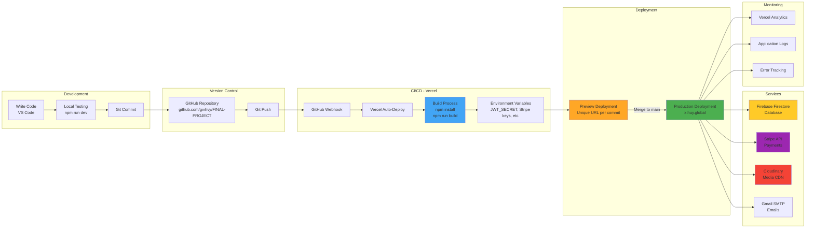

---

## Chart 1: Technology Stack Distribution
**Location:** Chapter 6.1 - Development Environment

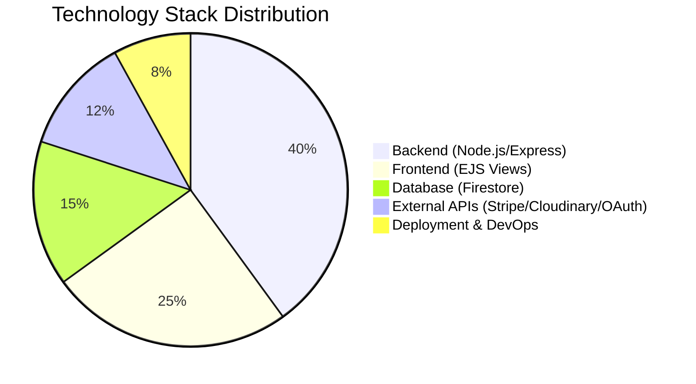

---

## Chart 2: API Endpoints by Category
**Location:** Chapter 5.3 - API Design

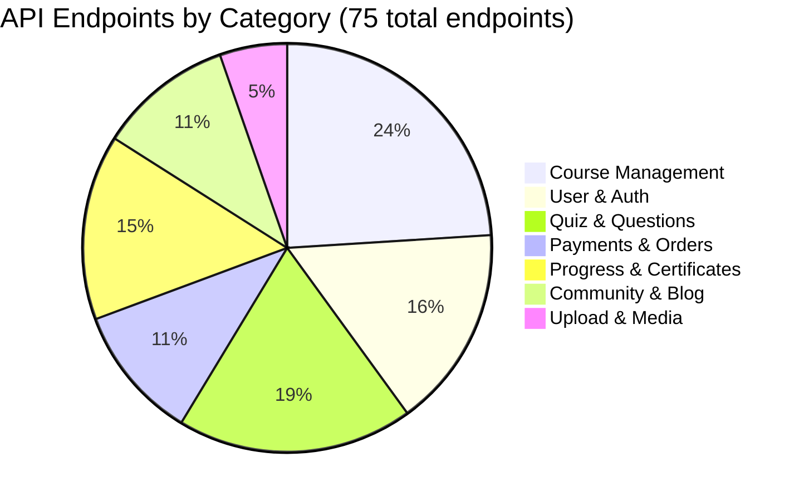

---

## Chart 3: Firestore Collections
**Location:** Chapter 5.2 - Database Design

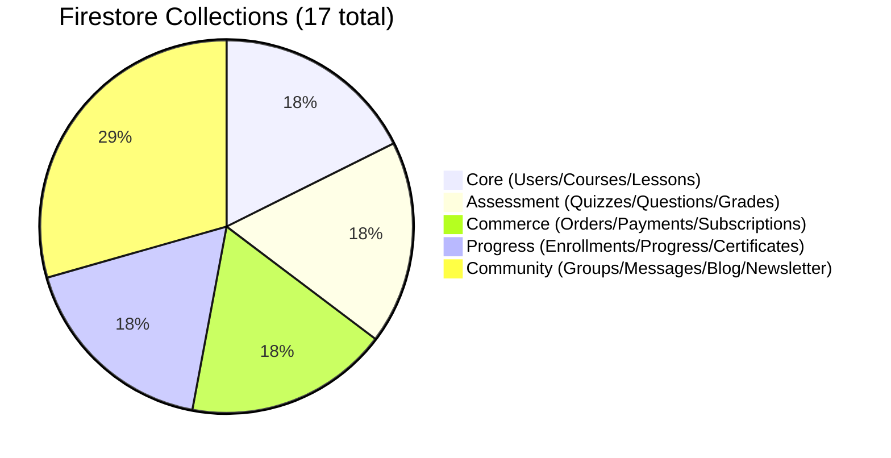

---

## Diagram 14: User Journey Map - Student
**Location:** Chapter 4.3 - Use Cases and User Stories

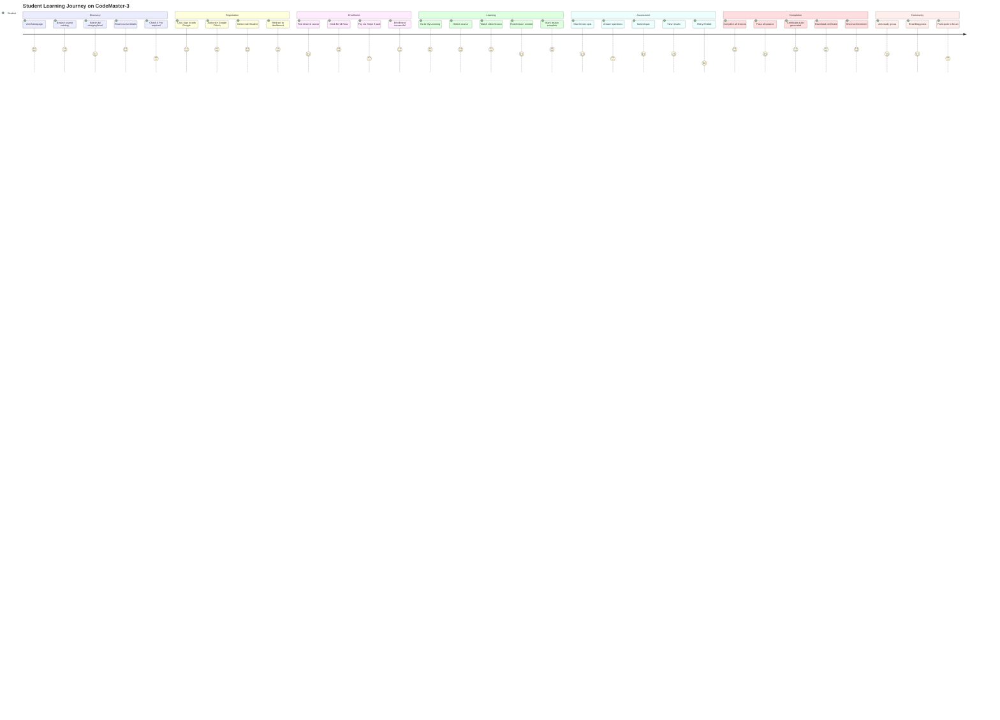

---

## Diagram 15: Error Handling & Logging
**Location:** Chapter 6.2 - Backend Implementation

```mermaid
flowchart TD
    Request[Client Request] --> TryCatch[Try-Catch Block in Controller]
    TryCatch --> Success{Execution successful?}

    Success -->|Yes| SuccessResponse[Return success response<br/>res.status(200/201).json]
    SuccessResponse --> LogSuccess[Log success info optional]
    LogSuccess --> ClientSuccess[Client receives data]

    Success -->|No| CatchBlock[Catch block triggered]
    CatchBlock --> ErrorType{Error type?}

    ErrorType -->|Validation Error| ValidationHandler[Return 400 Bad Request<br/>with validation details]
    ErrorType -->|Auth Error| AuthHandler[Return 401 Unauthorized<br/>or 403 Forbidden]
    ErrorType -->|Not Found| NotFoundHandler[Return 404 Not Found]
    ErrorType -->|Firestore Error| FirestoreHandler[Return 500 Internal Server Error]
    ErrorType -->|Stripe Error| StripeHandler[Return 402 Payment Required<br/>or 500]
    ErrorType -->|Unknown Error| GenericHandler[Return 500 Internal Server Error]

    ValidationHandler --> LogError[Console.error logging]
    AuthHandler --> LogError
    NotFoundHandler --> LogError
    FirestoreHandler --> LogError
    StripeHandler --> LogError
    GenericHandler --> LogError

    LogError --> ErrorDetails[Log: timestamp, userId, endpoint, error stack]
    ErrorDetails --> SafeResponse[Return user-friendly error message<br/>No sensitive data exposed]
    SafeResponse --> ClientError[Client receives error]

    ClientError --> UserNotification[Display error to user]
    UserNotification --> UserAction{User action?}

    UserAction -->|Retry| Request
    UserAction -->|Cancel| End([End])
    ClientSuccess --> End

    style SuccessResponse fill:#c8e6c9
    style ValidationHandler fill:#ffcc80
    style AuthHandler fill:#ef9a9a
    style NotFoundHandler fill:#ce93d8
    style FirestoreHandler fill:#ffab91
    style StripeHandler fill:#f48fb1
    style GenericHandler fill:#e57373
```

---

## Diagram 16: File Structure Tree
**Location:** Chapter 6.1 - Development Environment

```mermaid
graph TB
    Root[Codemaster-3/]

    Root --> Server[server/]
    Root --> Views[views/]
    Root --> Public[public/]
    Root --> Config[Config Files]

    Server --> ServerConfig[config/]
    Server --> Controllers[controllers/]
    Server --> Middleware[middleware/]
    Server --> Models[models/]
    Server --> Routes[routes/]
    Server --> Services[services/]
    Server --> Utils[utils/]

    ServerConfig --> Passport[passport.js]
    ServerConfig --> CloudinaryConf[cloudinary.js]

    Controllers --> AuthC[authController.js]
    Controllers --> UserC[userController.js]
    Controllers --> CourseC[courseController.js]
    Controllers --> PaymentC[paymentController.js]
    Controllers --> OtherC[... 11 more controllers]

    Middleware --> AuthM[authMiddleware.js]
    Middleware --> SubM[subscriptionMiddleware.js]

    Models --> UserM[User.js]
    Models --> CourseM[Course.js]
    Models --> QuizM[Quiz.js]
    Models --> OtherM[... 14 more models]

    Routes --> AuthR[authRoutes.js]
    Routes --> UserR[userRoutes.js]
    Routes --> CourseR[courseRoutes.js]
    Routes --> OtherR[... 12 more routes]

    Services --> Email[emailService.js]

    Utils --> EmailVal[emailValidator.js]
    Utils --> FirebaseH[firebaseHelpers.js]
    Utils --> CertGen[generateMissingCertificates.js]

    Views --> Layouts[layouts/]
    Views --> Partials[partials/]
    Views --> Pages[pages/]

    Layouts --> MainLayout[main.ejs]

    Partials --> Head[head.ejs]
    Partials --> Header[header.ejs]
    Partials --> Footer[footer.ejs]
    Partials --> LoginModals[login-modals.ejs]

    Pages --> Index[index.ejs]
    Pages --> Login[login.ejs]
    Pages --> Dashboard[*-dashboard.ejs]
    Pages --> Courses[courses.ejs]
    Pages --> OtherPages[... 10 more pages]

    Public --> CSS[css/]
    Public --> Images[images/]
    Public --> JS[js/]

    CSS --> DarkMode[darkmode-improved.css]

    JS --> AvatarHelper[avatar-helper.js]
    JS --> DarkModeJS[darkmode.js]
    JS --> LoginJS[login.js]

    Config --> ServerJS[server.js]
    Config --> Package[package.json]
    Config --> Env[.env]
    Config --> ServiceAccount[serviceAccountKey.json]

    style Root fill:#e3f2fd
    style Server fill:#fff9c4
    style Views fill:#c8e6c9
    style Public fill:#f8bbd0
    style Config fill:#ce93d8
```

---

## Instructions for Using These Diagrams

### Step 1: Generate Diagram Images
1. Go to https://mermaid.live/
2. Copy each mermaid code block (including ```mermaid and ```)
3. Paste into the editor
4. Click "Download PNG" or "Download SVG"
5. Save with naming convention: `diagram-01-system-architecture.png`, `diagram-02-database-erd.png`, etc.

### Step 2: Create Images Folder
Create folder structure:
```
F:\FINALPROJECT\Codemaster-3\images\
├── diagrams/
├── screenshots/
└── charts/
```

### Step 3: Place Diagram Images
Save generated diagrams to `F:\FINALPROJECT\Codemaster-3\images\diagrams\`

### Diagram Placement in Document:

1. **Diagram 1** (System Architecture) → Chapter 5.1, after line ~957
2. **Diagram 2** (Database ERD) → Chapter 5.2, after line ~1001
3. **Diagram 3** (OAuth Flow) → Chapter 2.4.1, line ~427
4. **Diagram 4** (Email Auth Flow) → Chapter 5.5, line ~1409
5. **Diagram 5** (Stripe Payment Flow) → Chapter 2.5.1, line ~460 & Chapter 6.4, line ~1735
6. **Diagram 6** (Cloudinary Upload) → Chapter 2.6.2, line ~487 & Chapter 6.4, line ~1813
7. **Diagram 7** (Enrollment & Progress) → Chapter 4.3, line ~650
8. **Diagram 8** (Quiz System) → Chapter 6.2, line ~1521
9. **Diagram 9** (API Routes) → Chapter 5.3, line ~1127
10. **Diagram 10** (Security Layers) → Chapter 5.5, line ~1409
11. **Diagram 11** (Subscription Tiers) → Chapter 2.5.3, line ~475
12. **Diagram 12** (Teacher Workflow) → Chapter 4.3, line ~650
13. **Diagram 13** (Deployment Pipeline) → Chapter 6.5, line ~1849
14. **Chart 1** (Tech Stack) → Chapter 6.1, line ~1511
15. **Chart 2** (API Distribution) → Chapter 5.3, line ~1127
16. **Chart 3** (Collections) → Chapter 5.2, line ~1001
17. **Diagram 14** (User Journey) → Chapter 4.3, line ~650
18. **Diagram 15** (Error Handling) → Chapter 6.2, line ~1521
19. **Diagram 16** (File Structure) → Chapter 6.1, line ~1511

---

**Note**: All diagrams are based on the ACTUAL CodeMaster-3 implementation found in F:\FINALPROJECT\Codemaster-3\
