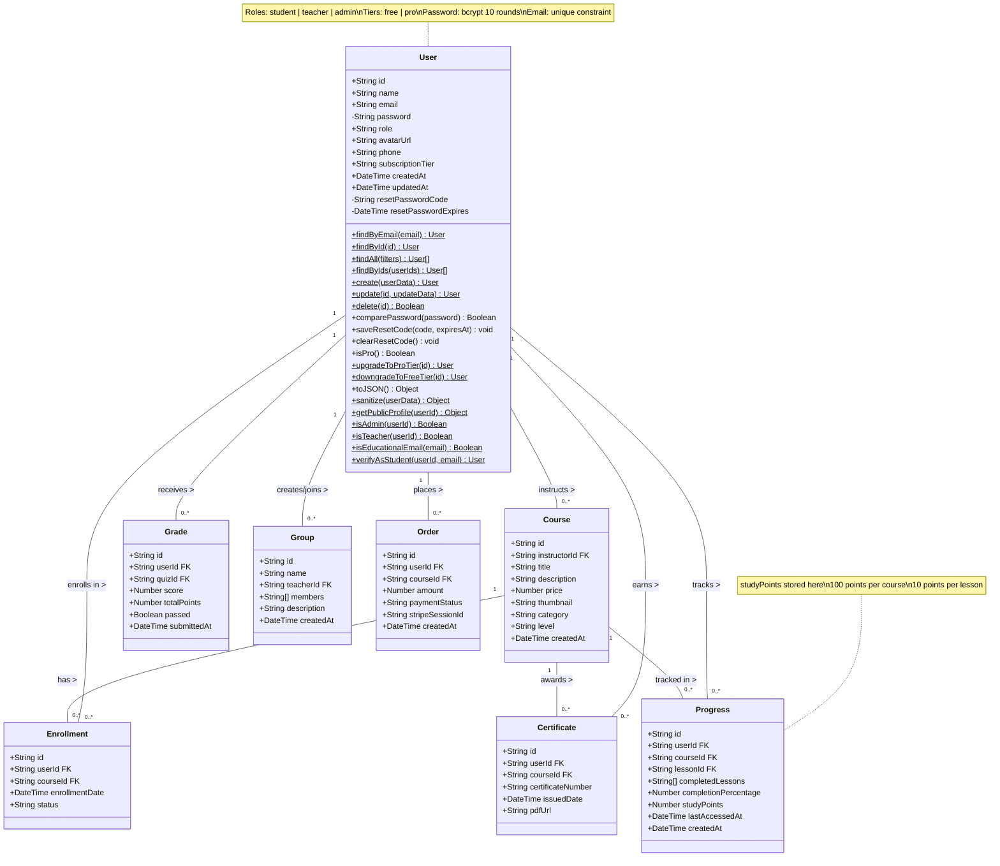
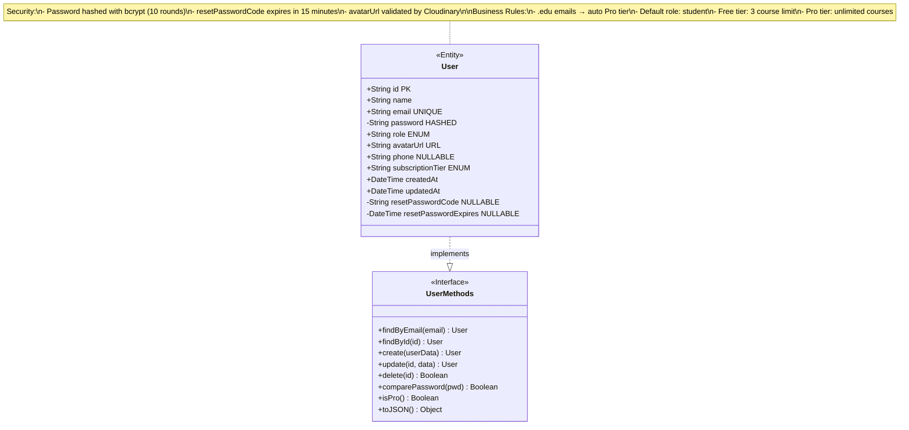
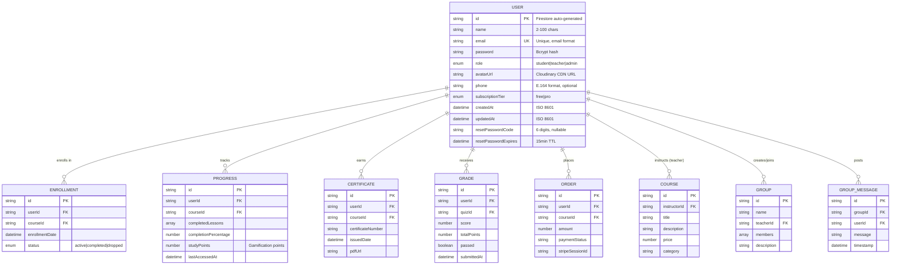
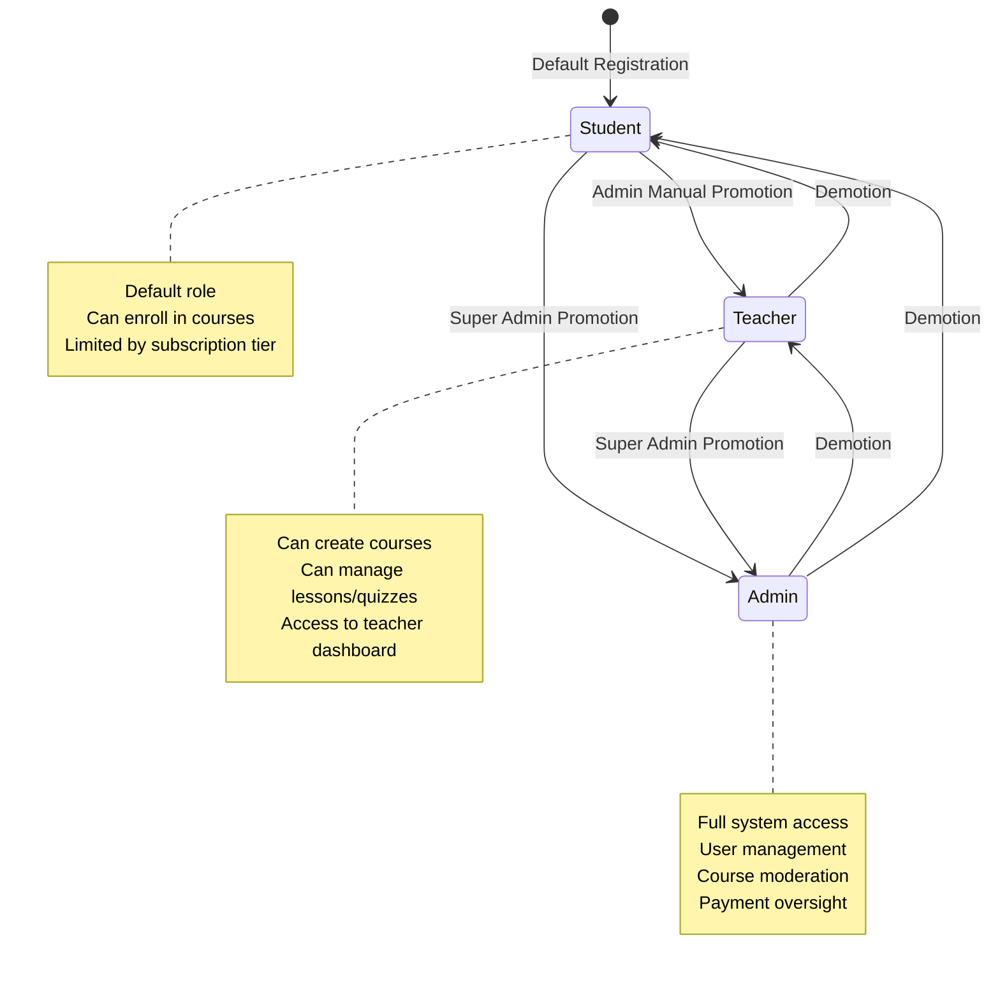
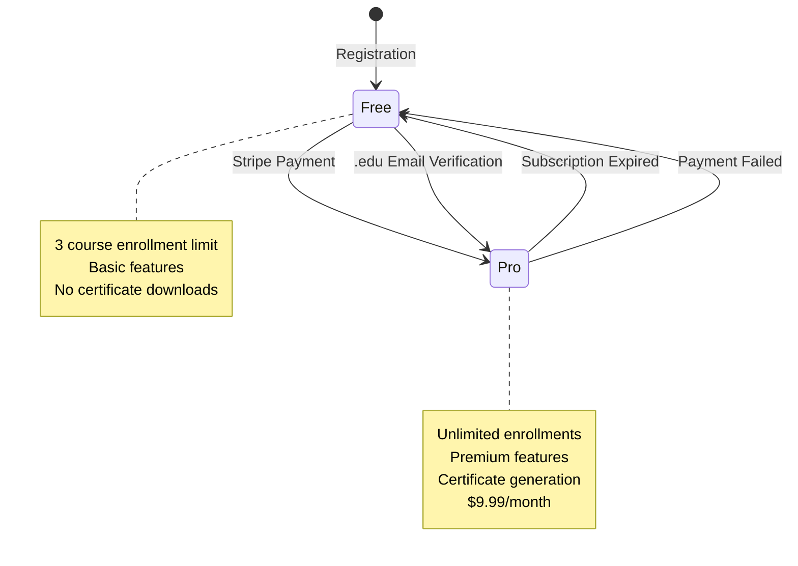
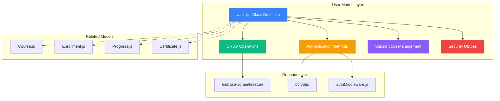
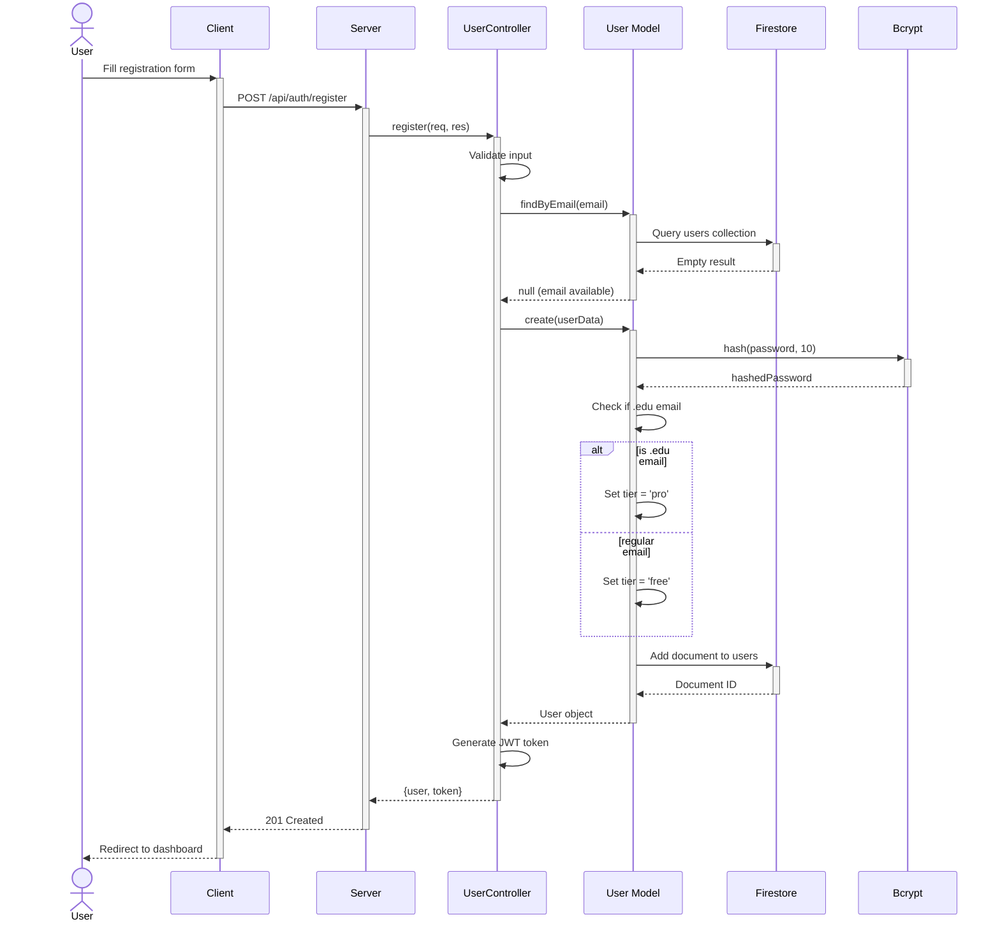
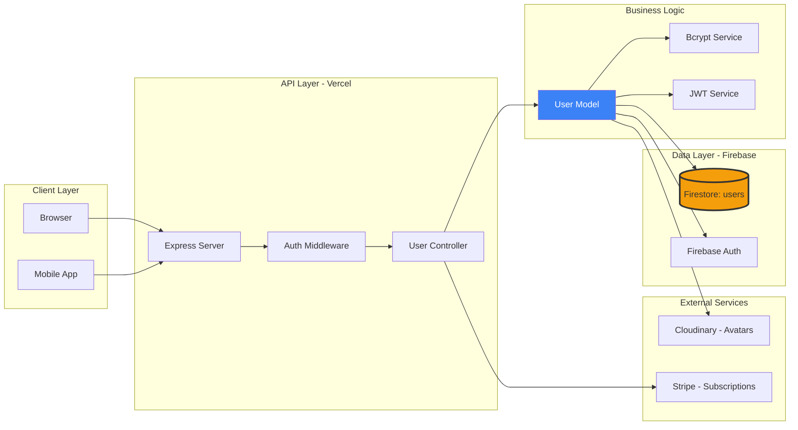

# User Schema - UML Class Diagram

## Complete UML Class Diagram with Relationships



---

## Simplified Diagram (User Entity Only)



---

## Entity-Relationship Diagram (Focus on User)



---

## State Diagram (User Role Transitions)



---

## Subscription Tier State Diagram



---

## Package Diagram (User Model Structure)



---

## Sequence Diagram: User Registration Flow



---

## Deployment Diagram: User Data Flow



---

## Data Dictionary

### User Collection Fields

| Field | Type | Constraints | Default | Description | Source |
|-------|------|-------------|---------|-------------|--------|
| `id` | String | Auto-generated, PK | - | Firestore document ID | User.js:10 |
| `name` | String | Required, 2-100 chars | - | User's full name | User.js:11 |
| `email` | String | Required, Unique, Email format | - | Authentication identifier | User.js:12 |
| `password` | String | Required, Bcrypt hash | - | Hashed password (10 rounds) | User.js:13 |
| `role` | Enum | `student` \| `teacher` \| `admin` | `student` | RBAC role (Sandhu et al., 1996) | User.js:14 |
| `avatarUrl` | String | Optional, URL format | `null` | Cloudinary CDN profile picture | User.js:15 |
| `phone` | String | Optional, E.164 format | `null` | Contact number | User.js:16 |
| `subscriptionTier` | Enum | `free` \| `pro` | `free` | Subscription level | User.js:17 |
| `createdAt` | DateTime | ISO 8601 string | Auto | Account creation timestamp | User.js:18 |
| `updatedAt` | DateTime | ISO 8601 string | Auto | Last modification timestamp | User.js:19 |
| `resetPasswordCode` | String | Optional, 6-digit | `null` | Password reset code (15min TTL) | User.js:20 |
| `resetPasswordExpires` | DateTime | Optional | `null` | Reset code expiration time | User.js:21 |

---

## Citations for Diagram

**References:**
- Sandhu, R.S., Coyne, E.J., Feinstein, H.L. and Youman, C.E. (1996) 'Role-based access control models', *Computer*, 29(2), pp. 38-47.
- Ferraiolo, D.F., Sandhu, R., Gavrila, S., Kuhn, D.R. and Chandramouli, R. (2003) 'Proposed NIST standard for role-based access control', *ACM Transactions on Information and System Security*, 4(3), pp. 224-274.
- Google Cloud (2023) *Firebase Documentation*. Mountain View: Google LLC. Available at: https://firebase.google.com/docs
- OWASP (2021) *OWASP Top 10 - 2021: The Ten Most Critical Web Application Security Risks*. Available at: https://owasp.org/Top10/

---

## Usage in Dissertation

### Chapter 5 - System Design

**Section 5.3.2: User Collection Schema**

```markdown
The User collection implements Role-Based Access Control (RBAC) following the model proposed by Sandhu et al. (1996) and standardized by NIST (Ferraiolo et al., 2003). Figure 5.2 presents the complete class diagram showing attributes, methods, and relationships with dependent entities.

**[INSERT: UML Class Diagram - Complete version above]**

*Figure 5.2:* UML class diagram of User model showing RBAC roles (student, teacher, admin), subscription tiers (free, pro), and relationships with enrollment, progress, and certificate entities. Private fields marked with (-) indicate security-sensitive data.

**Security Implementation:**
As illustrated in Figure 5.2, passwords are stored as bcrypt hashes with 10 salt rounds, following OWASP (2021) recommendations for password storage. The `resetPasswordCode` field implements temporary verification codes with 15-minute expiration (Time-To-Live), preventing brute-force attacks on password reset flows.

**Business Logic:**
The User model implements automatic tier assignment: users registering with educational email domains (.edu, .ac.uk, .edu.vn) receive `pro` tier access automatically (User.js:119), while standard emails default to `free` tier with a 3-course enrollment limit.

**Relationships:**
The ERD (Figure 5.3) demonstrates one-to-many relationships between User and dependent collections:
- User → Enrollment (students enroll in multiple courses)
- User → Progress (tracks completion across multiple courses)
- User → Certificate (awards earned upon course completion)
- User → Course (teachers instruct multiple courses)

This denormalized schema optimizes for Firestore's document-based query model (Moniruzzaman & Hossain, 2013), avoiding expensive join operations common in relational databases.
```

---

## All Diagrams Ready for Copy-Paste

✅ **Complete UML Class Diagram** - Shows all methods and relationships
✅ **Simplified Entity Diagram** - Focus on User schema only
✅ **ERD Diagram** - Database relationships
✅ **State Diagrams** - Role transitions and subscription tiers
✅ **Sequence Diagram** - Registration flow
✅ **Package Diagram** - Code structure
✅ **Deployment Diagram** - Data flow architecture
✅ **Data Dictionary Table** - Field specifications with line references

All diagrams use Mermaid syntax and can be rendered directly in Markdown!
