# User Collection Schema - Visual Representation

## Firestore Document Structure Visualization

```mermaid
graph TB
    subgraph "users Collection"
        subgraph "Document: abc123def456"
            A["📋 Document Fields"]

            B["🔑 id: 'abc123def456'<br/>Type: String<br/>Auto-generated"]
            C["✉️ email: 'student@example.com'<br/>Type: String<br/>Unique, Required"]
            D["👤 name: 'John Doe'<br/>Type: String<br/>Required"]
            E["🔒 password: '$2a$10...'<br/>Type: String<br/>Bcrypt Hash"]
            F["🎭 role: 'student'<br/>Type: Enum<br/>student | teacher | admin"]
            G["🖼️ avatarUrl: 'https://res.cloudinary...'<br/>Type: String<br/>URL, Nullable"]
            H["📱 phone: '+1234567890'<br/>Type: String<br/>Nullable"]
            I["💎 subscriptionTier: 'free'<br/>Type: Enum<br/>free | pro"]
            J["📅 createdAt: '2025-11-20T10:30:00Z'<br/>Type: DateTime<br/>ISO 8601"]
            K["🔄 updatedAt: '2025-11-21T14:22:00Z'<br/>Type: DateTime<br/>ISO 8601"]
            L["🔐 resetPasswordCode: null<br/>Type: String<br/>6-digit, 15min TTL"]
            M["⏰ resetPasswordExpires: null<br/>Type: DateTime<br/>Nullable"]

            A --> B
            A --> C
            A --> D
            A --> E
            A --> F
            A --> G
            A --> H
            A --> I
            A --> J
            A --> K
            A --> L
            A --> M
        end
    end

    style A fill:#3b82f6,color:#fff,stroke:#1e40af,stroke-width:3px
    style B fill:#10b981,color:#fff
    style C fill:#f59e0b,color:#fff
    style D fill:#8b5cf6,color:#fff
    style E fill:#ef4444,color:#fff
    style F fill:#ec4899,color:#fff
    style G fill:#06b6d4,color:#fff
    style H fill:#84cc16,color:#fff
    style I fill:#f97316,color:#fff
    style J fill:#14b8a6,color:#fff
    style K fill:#6366f1,color:#fff
    style L fill:#f43f5e,color:#fff
    style M fill:#a855f7,color:#fff
```



---

## JSON Document Example

```json
{
  "id": "abc123def456",
  "email": "student@example.com",
  "name": "John Doe",
  "password": "$2a$10$N9qo8uLOickgx2ZMRZoMye",
  "role": "student",
  "avatarUrl": "https://res.cloudinary.com/demo/image/upload/v1/avatars/student.jpg",
  "phone": "+1234567890",
  "subscriptionTier": "free",
  "createdAt": "2025-11-20T10:30:00.000Z",
  "updatedAt": "2025-11-21T14:22:00.000Z",
  "resetPasswordCode": null,
  "resetPasswordExpires": null
}
```

---

## Field-by-Field Visual Breakdown


---

## Visual Schema Table


---

## Data Type Visualization


---

## Firestore Document Tree View

```
📁 users (Collection)
│
└── 📄 abc123def456 (Document ID)
    ├── 🔑 id: "abc123def456"
    ├── ✉️ email: "student@example.com"
    ├── 👤 name: "John Doe"
    ├── 🔒 password: "$2a$10$N9qo8uLOickgx2ZMRZoMye..."
    ├── 🎭 role: "student"
    │   └── 📌 Enum: student | teacher | admin
    ├── 🖼️ avatarUrl: "https://res.cloudinary.com/..."
    ├── 📱 phone: "+1234567890"
    ├── 💎 subscriptionTier: "free"
    │   └── 📌 Enum: free | pro
    ├── 📅 createdAt: "2025-11-20T10:30:00.000Z"
    ├── 🔄 updatedAt: "2025-11-21T14:22:00.000Z"
    ├── 🔐 resetPasswordCode: null
    └── ⏰ resetPasswordExpires: null
```

---

## Color-Coded Field Categories

```mermaid
flowchart TB
    subgraph IDENTITY["🔵 IDENTITY FIELDS"]
        A1[id]
        A2[email]
        A3[name]
    end

    subgraph AUTH["🟡 AUTHENTICATION"]
        B1[password]
        B2[role]
        B3[resetPasswordCode]
        B4[resetPasswordExpires]
    end

    subgraph PROFILE["🟣 PROFILE DATA"]
        C1[avatarUrl]
        C2[phone]
    end

    subgraph BILLING["🟠 SUBSCRIPTION"]
        D1[subscriptionTier]
    end

    subgraph META["🟢 METADATA"]
        E1[createdAt]
        E2[updatedAt]
    end

    USER[User Document] --> IDENTITY
    USER --> AUTH
    USER --> PROFILE
    USER --> BILLING
    USER --> META

    style USER fill:#1e293b,color:#fff,stroke:#0ea5e9,stroke-width:4px
    style IDENTITY fill:#3b82f6,color:#fff
    style AUTH fill:#f59e0b,color:#fff
    style PROFILE fill:#8b5cf6,color:#fff
    style BILLING fill:#ec4899,color:#fff
    style META fill:#10b981,color:#fff
```



---

## Constraint & Validation Diagram

```mermaid
graph TB
    A[User Input] --> B{Validation}

    B -->|email| C[Email Format]
    B -->|password| D[Min 8 chars]
    B -->|name| E[2-100 chars]
    B -->|phone| F[E.164 format]
    B -->|avatarUrl| G[Valid URL]

    C --> H{Check Unique}
    H -->|Exists| I[❌ Error: Email in use]
    H -->|New| J[✅ Continue]

    D --> K[Bcrypt Hash]
    K --> L[10 Salt Rounds]

    E --> M{Valid Length?}
    M -->|No| N[❌ Error: Invalid name]
    M -->|Yes| O[✅ Accept]

    J --> P[Create User Doc]
    L --> P
    O --> P

    P --> Q{.edu email?}
    Q -->|Yes| R[Set tier: pro]
    Q -->|No| S[Set tier: free]

    R --> T[Save to Firestore]
    S --> T

    style A fill:#3b82f6,color:#fff
    style P fill:#10b981,color:#fff
    style T fill:#f59e0b,color:#fff
    style I fill:#ef4444,color:#fff
    style N fill:#ef4444,color:#fff
```



---

## Security & Privacy Visual

```mermaid
graph LR
    subgraph PUBLIC["🌐 Public Data"]
        A1[id]
        A2[name]
        A3[avatarUrl]
        A4[role]
    end

    subgraph PRIVATE["🔒 Private Data"]
        B1[email]
        B2[phone]
        B3[subscriptionTier]
    end

    subgraph SENSITIVE["🚨 Sensitive Data - Never Expose"]
        C1[password]
        C2[resetPasswordCode]
        C3[resetPasswordExpires]
    end

    D[User.toJSON] -->|Returns| PUBLIC
    D -->|Returns| PRIVATE
    D -->|🚫 REMOVES| SENSITIVE

    E[API Response] --> PUBLIC
    E --> PRIVATE
    E -.->|Never includes| SENSITIVE

    style PUBLIC fill:#10b981,color:#fff
    style PRIVATE fill:#f59e0b,color:#fff
    style SENSITIVE fill:#ef4444,color:#fff
    style D fill:#3b82f6,color:#fff
    style E fill:#8b5cf6,color:#fff
```



---

## Example Documents by Role

### Student Example
```json
{
  "id": "student_001",
  "email": "alice@university.edu",
  "name": "Alice Johnson",
  "role": "student",
  "subscriptionTier": "pro",
  "avatarUrl": "https://res.cloudinary.com/demo/alice.jpg",
  "phone": "+1-555-0101",
  "createdAt": "2025-01-15T08:00:00.000Z",
  "updatedAt": "2025-11-20T10:30:00.000Z"
}
```

### Teacher Example
```json
{
  "id": "teacher_001",
  "email": "bob.smith@school.edu",
  "name": "Dr. Bob Smith",
  "role": "teacher",
  "subscriptionTier": "pro",
  "avatarUrl": "https://res.cloudinary.com/demo/bob.jpg",
  "phone": "+1-555-0202",
  "createdAt": "2024-09-01T09:00:00.000Z",
  "updatedAt": "2025-11-21T11:45:00.000Z"
}
```

### Admin Example
```json
{
  "id": "admin_001",
  "email": "admin@codemaster.com",
  "name": "System Administrator",
  "role": "admin",
  "subscriptionTier": "pro",
  "avatarUrl": "https://res.cloudinary.com/demo/admin.jpg",
  "phone": "+1-555-0000",
  "createdAt": "2023-01-01T00:00:00.000Z",
  "updatedAt": "2025-11-21T14:22:00.000Z"
}
```

---

## Usage in Dissertation

**Copy this for your Chapter 5 - Database Design:**

```markdown
### 5.2.1 User Collection Schema

Figure 5.X illustrates the User collection document structure in Firebase Firestore. The schema implements Role-Based Access Control (RBAC) as specified by Sandhu et al. (1996), with three distinct user roles: student, teacher, and administrator.

**[INSERT: Visual Schema Diagram - Color-Coded Field Categories]**

*Figure 5.X:* User collection schema showing field categorization: identity (blue), authentication (yellow), profile data (purple), subscription (orange), and metadata (green). Sensitive fields (password, reset codes) are never exposed via API responses.

**Field Specifications:**

The User document contains 12 fields organized into five functional categories:

1. **Identity Fields** (3): Unique identifiers and basic user information
2. **Authentication** (4): Security credentials and password reset mechanism
3. **Profile Data** (2): Optional user-provided information
4. **Subscription** (1): Billing tier determining feature access
5. **Metadata** (2): Timestamp tracking for audit purposes

**Security Implementation:**

As shown in Figure 5.X, the `password` field stores bcrypt hashes with 10 salt rounds, following OWASP (2021) recommendations. Password reset codes (`resetPasswordCode`) expire after 15 minutes, implementing time-based one-time password (TOTP) principles to prevent brute-force attacks.

**Business Rules:**

Users registering with educational email domains (.edu, .ac.uk, .edu.vn) automatically receive `pro` tier access, while standard emails default to `free` tier with a 3-course enrollment limit. This dual-tier system enables freemium monetization strategy (Chargify, 2019).
```

---

## Generate PNG/SVG Instructions

To create a screenshot of the schema:

1. **Option A - Mermaid Live Editor:**
   - Go to https://mermaid.live/
   - Paste any diagram code above
   - Click "Download PNG" or "Download SVG"
   - Save as: `user-schema-visual.png`

2. **Option B - VS Code:**
   - Install "Markdown Preview Mermaid Support" extension
   - Open this file in preview
   - Right-click diagram → "Copy Image"
   - Paste into Paint/Photoshop
   - Save as PNG

3. **Option C - Screenshot Tool:**
   - Render this file in GitHub/GitLab
   - Use Snipping Tool to capture
   - Crop and save

---

**Recommended for Dissertation:**
- Use **"Color-Coded Field Categories"** diagram for Chapter 5
- Use **"Security & Privacy Visual"** for security discussion
- Use **"Firestore Document Tree View"** for appendix reference
