# Use Case Diagram - Administrator Role

```mermaid
flowchart LR
    %% ============================================
    %% ADMINISTRATOR ACTOR
    %% ============================================
    Admin(("👨‍💼 Administrator"))

    %% ============================================
    %% SYSTEM BOUNDARY
    %% ============================================
    subgraph System["UniLearn Learning Management System"]
        
        %% Authentication Module (2 UC)
        subgraph Auth["Authentication"]
            UC2["UC2 Login with Email/Password"]
            UC5["UC5 Logout"]
        end

        %% Admin Functions Module (6 UC)
        subgraph AdminFunc["Admin Functions"]
            UC34["UC34 Manage Users"]
            UC35["UC35 Manage All Courses"]
            UC36["UC36 View Analytics Dashboard"]
            UC37["UC37 Monitor Payments"]
            UC38["UC38 Manage Certificates"]
            UC39["UC39 Manage Blog Posts"]
        end
    end

    %% ============================================
    %% ADMIN CONNECTIONS (8 total)
    %% ============================================
    
    %% Authentication (2)
    Admin --- UC2
    Admin --- UC5
    
    %% Admin Functions (6)
    Admin --- UC34
    Admin --- UC35
    Admin --- UC36
    Admin --- UC37
    Admin --- UC38
    Admin --- UC39
```

---

## 📊 Administrator Role Summary

| Module | Use Cases | Count |
|--------|-----------|-------|
| **Authentication** | UC2, UC5 | 2 |
| **Admin Functions** | UC34-UC39 | 6 |
| **Total** | | **8** |

---

## 📝 Use Case Details

| UC ID | Use Case Name | Description |
|-------|---------------|-------------|
| UC2 | Login with Email/Password | Admin logs in using credentials |
| UC5 | Logout | Admin ends session |
| UC34 | Manage Users | View, edit, delete user accounts; assign roles |
| UC35 | Manage All Courses | Oversee all courses; approve/reject/delete courses |
| UC36 | View Analytics Dashboard | Monitor platform statistics (users, courses, revenue) |
| UC37 | Monitor Payments | View all Stripe transactions; track revenue |
| UC38 | Manage Certificates | View all issued certificates; revoke if needed |
| UC39 | Manage Blog Posts | Create, edit, delete blog posts on platform |
