# UniLearn Use Case Diagram - Mermaid Code

```mermaid
flowchart LR
    %% ============================================
    %% ACTORS
    %% ============================================
    Student(("👤 Student"))
    Teacher(("👨‍🏫 Teacher"))
    Admin(("👨‍💼 Administrator"))

    %% ============================================
    %% SYSTEM BOUNDARY
    %% ============================================
    subgraph System["UniLearn Learning Management System"]
        
        %% Authentication Module
        subgraph Auth["Authentication"]
            UC1["UC1 Register Account"]
            UC2["UC2 Login with Email/Password"]
            UC3["UC3 Login with Google OAuth"]
            UC4["UC4 Reset Password"]
            UC5["UC5 Logout"]
        end

        %% Course Management Module
        subgraph Course["Course Management"]
            UC6["UC6 Browse Course Catalog"]
            UC7["UC7 Search/Filter Courses"]
            UC8["UC8 View Course Details"]
            UC9["UC9 Enroll in Course"]
            UC10["UC10 Access Course Content"]
            UC11["UC11 Watch Video Lessons"]
            UC12["UC12 Mark Lesson Complete"]
            UC13["UC13 Track Progress"]
        end

        %% Assessment Module
        subgraph Assessment["Assessment"]
            UC14["UC14 Take Quiz"]
            UC15["UC15 Submit Quiz Answers"]
            UC16["UC16 View Quiz Results"]
            UC17["UC17 View Grades"]
        end

        %% Certification Module
        subgraph Cert["Certification"]
            UC18["UC18 Generate Certificate"]
            UC19["UC19 Download Certificate PDF"]
            UC20["UC20 Verify Certificate"]
        end

        %% Payment Module
        subgraph Payment["Payment"]
            UC21["UC21 View Subscription Plans"]
            UC22["UC22 Purchase Pro Subscription"]
            UC23["UC23 View Payment History"]
        end

        %% Community Module
        subgraph Community["Community"]
            UC24["UC24 Join Study Group"]
            UC25["UC25 Post in Group Forum"]
            UC26["UC26 View Leaderboard"]
        end

        %% Teacher Functions Module
        subgraph TeacherFunc["Teacher Functions"]
            UC27["UC27 Create Course"]
            UC28["UC28 Edit Course"]
            UC29["UC29 Delete Course"]
            UC30["UC30 Create Quiz"]
            UC31["UC31 Manage Questions"]
            UC32["UC32 View Student Progress"]
            UC33["UC33 Manage Lessons"]
        end

        %% Admin Functions Module
        subgraph AdminFunc["Admin Functions"]
            UC34["UC34 Manage Users"]
            UC35["UC35 Manage All Courses"]
            UC36["UC36 View Analytics Dashboard"]
            UC37["UC37 Monitor Payments"]
            UC38["UC38 Manage Certificates"]
            UC39["UC39 Manage Blog Posts"]
        end
    end

    %% ============================================
    %% STUDENT CONNECTIONS (26 total)
    %% ============================================
    %% Authentication
    Student --- UC1
    Student --- UC2
    Student --- UC3
    Student --- UC4
    Student --- UC5
    
    %% Course Management
    Student --- UC6
    Student --- UC7
    Student --- UC8
    Student --- UC9
    Student --- UC10
    Student --- UC11
    Student --- UC12
    Student --- UC13
    
    %% Assessment
    Student --- UC14
    Student --- UC15
    Student --- UC16
    Student --- UC17
    
    %% Certification
    Student --- UC18
    Student --- UC19
    Student --- UC20
    
    %% Payment
    Student --- UC21
    Student --- UC22
    Student --- UC23
    
    %% Community
    Student --- UC24
    Student --- UC25
    Student --- UC26

    %% ============================================
    %% TEACHER CONNECTIONS (12 total)
    %% ============================================
    %% Authentication
    Teacher --- UC2
    Teacher --- UC3
    Teacher --- UC5
    
    %% Teacher Functions
    Teacher --- UC27
    Teacher --- UC28
    Teacher --- UC29
    Teacher --- UC30
    Teacher --- UC31
    Teacher --- UC32
    Teacher --- UC33
    
    %% Community
    Teacher --- UC24
    Teacher --- UC25

    %% ============================================
    %% ADMIN CONNECTIONS (8 total)
    %% ============================================
    %% Authentication
    Admin --- UC2
    Admin --- UC5
    
    %% Admin Functions
    Admin --- UC34
    Admin --- UC35
    Admin --- UC36
    Admin --- UC37
    Admin --- UC38
    Admin --- UC39
```

---

## Summary
- **39 Use Cases** across 8 functional modules
- **3 Actors**: Student, Teacher, Administrator
- **46 Total Connections**:
  - Student: 26 connections
  - Teacher: 12 connections  
  - Admin: 8 connections
