# Use Case Diagram - Student Role

```mermaid
flowchart LR
    %% ============================================
    %% STUDENT ACTOR
    %% ============================================
    Student(("👤 Student"))

    %% ============================================
    %% SYSTEM BOUNDARY
    %% ============================================
    subgraph System["UniLearn Learning Management System"]
        
        %% Authentication Module (5 UC)
        subgraph Auth["Authentication"]
            UC1["UC1 Register Account"]
            UC2["UC2 Login with Email/Password"]
            UC3["UC3 Login with Google OAuth"]
            UC4["UC4 Reset Password"]
            UC5["UC5 Logout"]
        end

        %% Course Management Module (8 UC)
        subgraph Course["Course Management"]
            UC6["UC6 Browse Course Catalog"]
            UC7["UC7 Search/Filter Courses"]
            UC8["UC8 View Course Details"]
            UC9["UC9 Enroll in Course"]
            UC10["UC10 Access Course Content"]
            UC11["UC11 Watch Video Lessons"]
            UC12["UC12 Mark Lesson Complete"]
            UC13["UC13 Track Progress"]
        end

        %% Assessment Module (4 UC)
        subgraph Assessment["Assessment"]
            UC14["UC14 Take Quiz"]
            UC15["UC15 Submit Quiz Answers"]
            UC16["UC16 View Quiz Results"]
            UC17["UC17 View Grades"]
        end

        %% Certification Module (3 UC)
        subgraph Cert["Certification"]
            UC18["UC18 Generate Certificate"]
            UC19["UC19 Download Certificate PDF"]
            UC20["UC20 Verify Certificate"]
        end

        %% Payment Module (3 UC)
        subgraph Payment["Payment"]
            UC21["UC21 View Subscription Plans"]
            UC22["UC22 Purchase Pro Subscription"]
            UC23["UC23 View Payment History"]
        end

        %% Community Module (3 UC)
        subgraph Community["Community"]
            UC24["UC24 Join Study Group"]
            UC25["UC25 Post in Group Forum"]
            UC26["UC26 View Leaderboard"]
        end
    end

    %% ============================================
    %% STUDENT CONNECTIONS (26 total)
    %% ============================================
    
    %% Authentication (5)
    Student --- UC1
    Student --- UC2
    Student --- UC3
    Student --- UC4
    Student --- UC5
    
    %% Course Management (8)
    Student --- UC6
    Student --- UC7
    Student --- UC8
    Student --- UC9
    Student --- UC10
    Student --- UC11
    Student --- UC12
    Student --- UC13
    
    %% Assessment (4)
    Student --- UC14
    Student --- UC15
    Student --- UC16
    Student --- UC17
    
    %% Certification (3)
    Student --- UC18
    Student --- UC19
    Student --- UC20
    
    %% Payment (3)
    Student --- UC21
    Student --- UC22
    Student --- UC23
    
    %% Community (3)
    Student --- UC24
    Student --- UC25
    Student --- UC26
```

---

## 📊 Student Role Summary

| Module | Use Cases | Count |
|--------|-----------|-------|
| **Authentication** | UC1-UC5 | 5 |
| **Course Management** | UC6-UC13 | 8 |
| **Assessment** | UC14-UC17 | 4 |
| **Certification** | UC18-UC20 | 3 |
| **Payment** | UC21-UC23 | 3 |
| **Community** | UC24-UC26 | 3 |
| **Total** | | **26** |
