# Use Case Diagram - Teacher Role

```mermaid
flowchart LR
    %% ============================================
    %% TEACHER ACTOR
    %% ============================================
    Teacher(("👨‍🏫 Teacher"))

    %% ============================================
    %% SYSTEM BOUNDARY
    %% ============================================
    subgraph System["UniLearn Learning Management System"]
        
        %% Authentication Module (3 UC)
        subgraph Auth["Authentication"]
            UC2["UC2 Login with Email/Password"]
            UC3["UC3 Login with Google OAuth"]
            UC5["UC5 Logout"]
        end

        %% Teacher Functions Module (7 UC)
        subgraph TeacherFunc["Teacher Functions"]
            UC27["UC27 Create Course"]
            UC28["UC28 Edit Course"]
            UC29["UC29 Delete Course"]
            UC30["UC30 Create Quiz"]
            UC31["UC31 Manage Questions"]
            UC32["UC32 View Student Progress"]
            UC33["UC33 Manage Lessons"]
        end

        %% Community Module (2 UC)
        subgraph Community["Community"]
            UC24["UC24 Join Study Group"]
            UC25["UC25 Post in Group Forum"]
        end
    end

    %% ============================================
    %% TEACHER CONNECTIONS (12 total)
    %% ============================================
    
    %% Authentication (3)
    Teacher --- UC2
    Teacher --- UC3
    Teacher --- UC5
    
    %% Teacher Functions (7)
    Teacher --- UC27
    Teacher --- UC28
    Teacher --- UC29
    Teacher --- UC30
    Teacher --- UC31
    Teacher --- UC32
    Teacher --- UC33
    
    %% Community (2)
    Teacher --- UC24
    Teacher --- UC25
```

---

## 📊 Teacher Role Summary

| Module | Use Cases | Count |
|--------|-----------|-------|
| **Authentication** | UC2, UC3, UC5 | 3 |
| **Teacher Functions** | UC27-UC33 | 7 |
| **Community** | UC24, UC25 | 2 |
| **Total** | | **12** |

---

## 📝 Use Case Details

| UC ID | Use Case Name | Description |
|-------|---------------|-------------|
| UC2 | Login with Email/Password | Teacher logs in using credentials |
| UC3 | Login with Google OAuth | Teacher logs in via Google account |
| UC5 | Logout | Teacher ends session |
| UC24 | Join Study Group | Teacher joins or creates study groups |
| UC25 | Post in Group Forum | Teacher posts announcements/resources |
| UC27 | Create Course | Teacher creates new course with title, description, thumbnail |
| UC28 | Edit Course | Teacher updates course information |
| UC29 | Delete Course | Teacher removes course from platform |
| UC30 | Create Quiz | Teacher creates quiz for course assessment |
| UC31 | Manage Questions | Teacher adds/edits/deletes quiz questions |
| UC32 | View Student Progress | Teacher monitors enrolled students' progress |
| UC33 | Manage Lessons | Teacher creates/edits/deletes course lessons |
