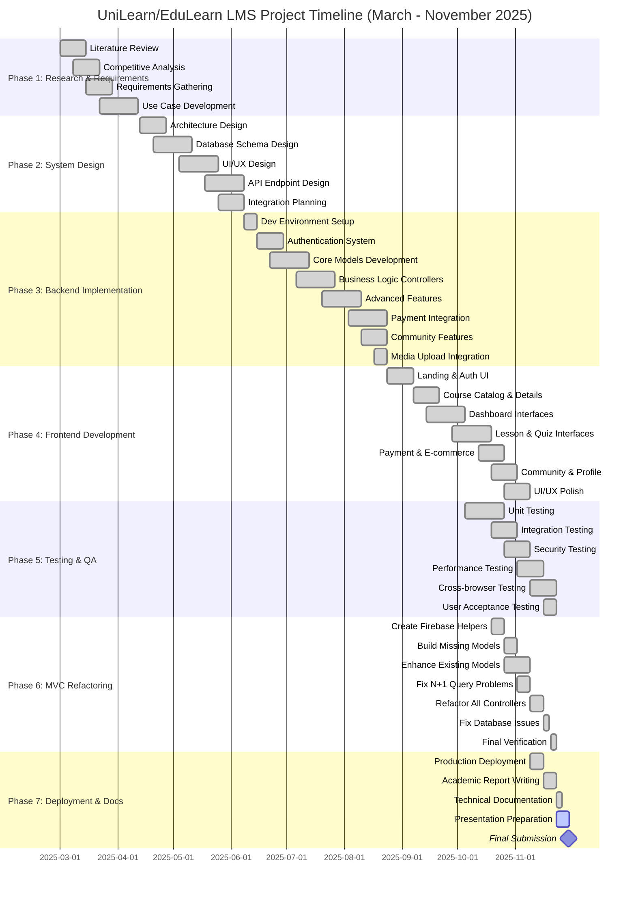
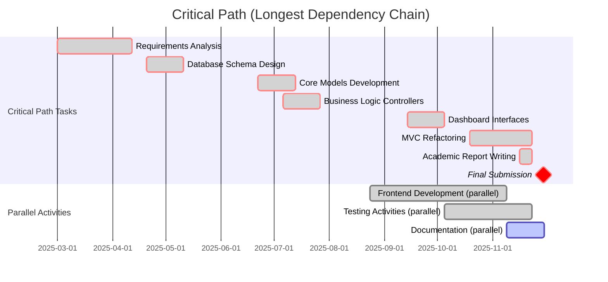
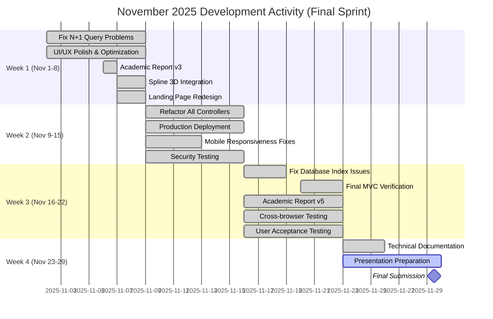
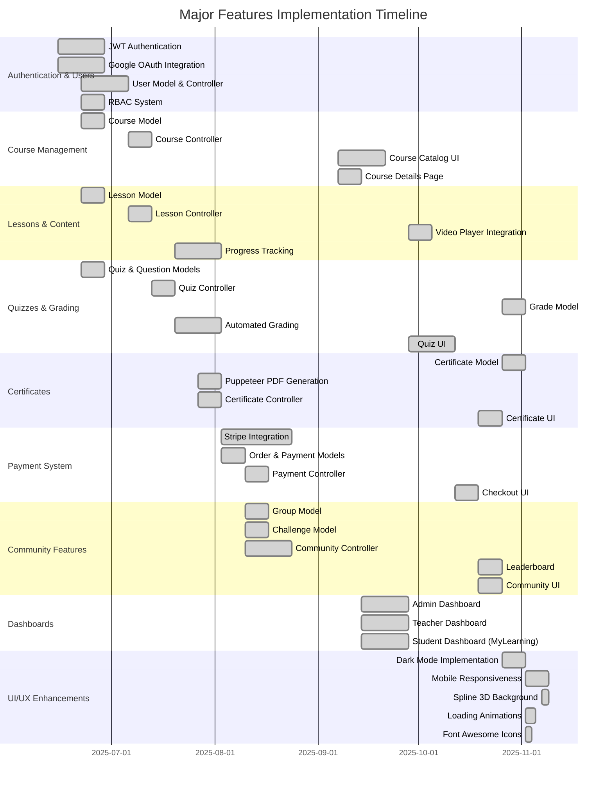
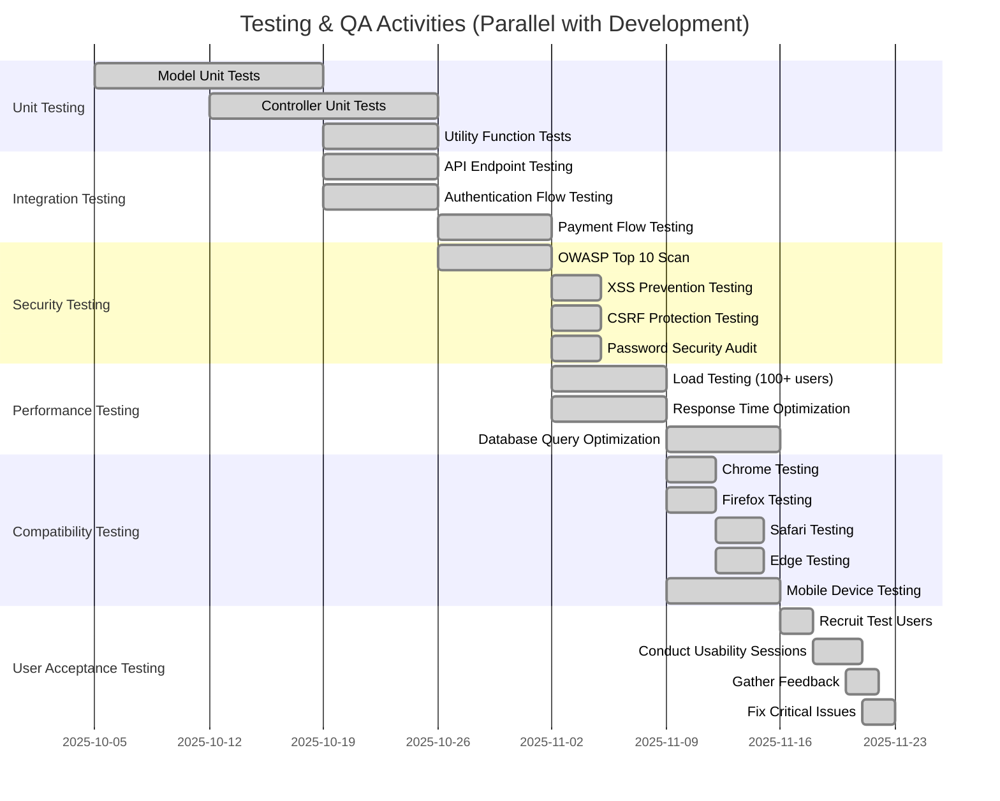
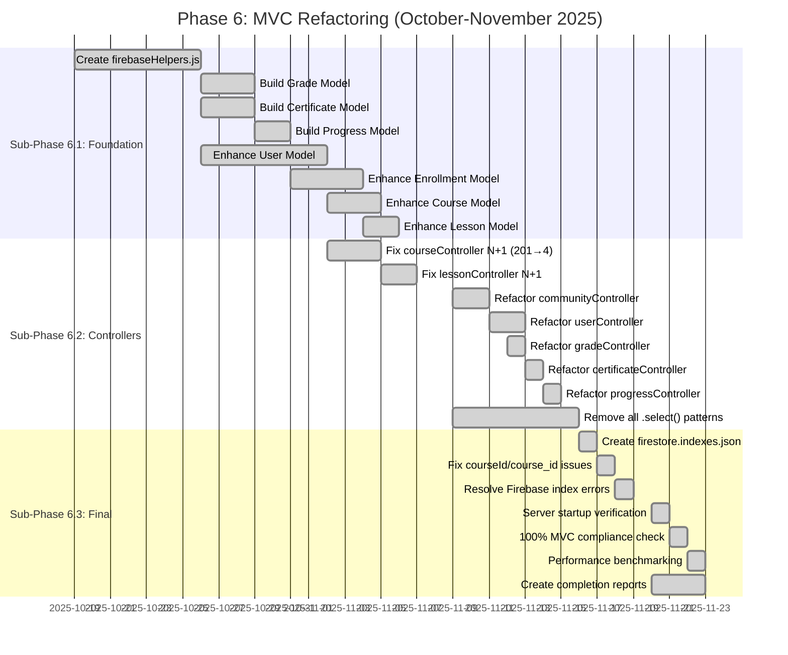
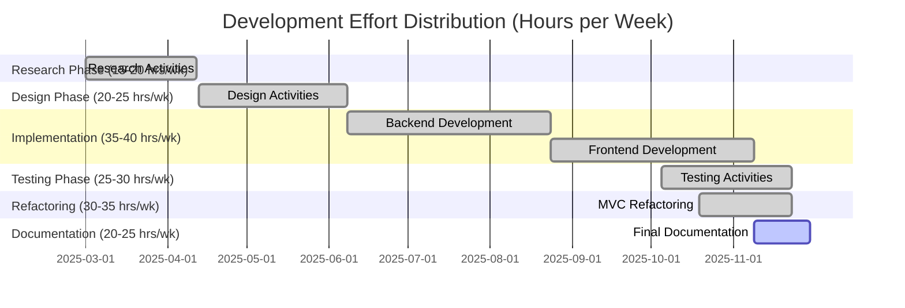
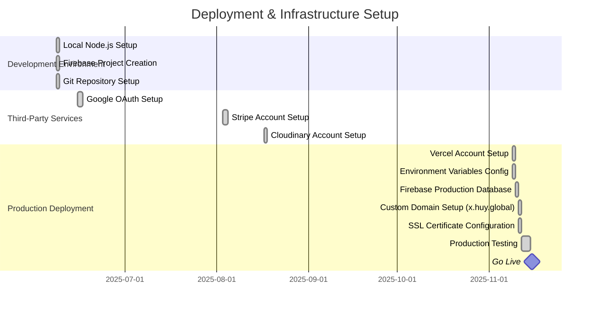
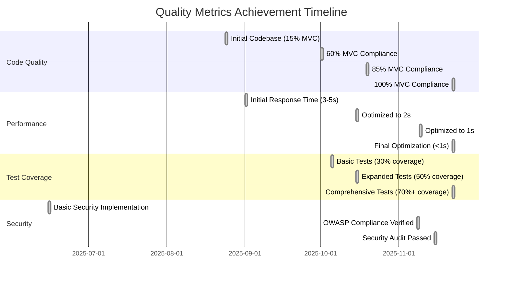

# CODEMASTER-3 PROJECT GANTT CHART (MERMAID VISUALIZATION)

This file contains Mermaid Gantt chart code that can be rendered in GitHub, GitLab, or Mermaid Live Editor.

## How to View
1. **GitHub**: View this file directly on GitHub (auto-renders Mermaid)
2. **Mermaid Live Editor**: Copy code to https://mermaid.live/
3. **VS Code**: Install "Markdown Preview Mermaid Support" extension
4. **GitLab**: View directly in GitLab (auto-renders Mermaid)

---

## Complete Project Timeline



---

## Simplified Phase Overview

```mermaid
gantt
    title Project Phases Overview (7 Major Phases)
    dateFormat YYYY-MM-DD

    section Project Phases
    Phase 1: Research & Requirements     :done, phase1, 2025-03-01, 42d
    Phase 2: System Design               :done, phase2, 2025-04-13, 56d
    Phase 3: Backend Implementation      :done, phase3, 2025-06-08, 77d
    Phase 4: Frontend Development        :done, phase4, 2025-08-24, 77d
    Phase 5: Testing & QA                :done, phase5, 2025-10-05, 49d
    Phase 6: MVC Refactoring             :done, phase6, 2025-10-19, 35d
    Phase 7: Deployment & Docs           :active, phase7, 2025-11-09, 21d

    section Milestones
    Requirements Complete                :milestone, m1, 2025-04-12, 0d
    Design Complete                      :milestone, m2, 2025-06-07, 0d
    Backend Complete                     :milestone, m3, 2025-08-23, 0d
    Frontend Complete                    :milestone, m4, 2025-11-08, 0d
    Testing Complete                     :milestone, m5, 2025-11-22, 0d
    MVC Refactoring Complete             :milestone, m6, 2025-11-22, 0d
    Final Submission                     :milestone, m7, 2025-11-29, 0d
```

---

## Critical Path Analysis



---

## Recent Development Activity (November 2025)



---

## Feature Implementation Timeline



---

## Testing & Quality Assurance Timeline



---

## MVC Refactoring Detailed Timeline



---

## Documentation & Reporting Timeline

```mermaid
gantt
    title Documentation & Academic Reporting
    dateFormat YYYY-MM-DD

    section Technical Documentation
    API Documentation                    :done, doc_api, 2025-10-15, 14d
    Database Schema Docs                 :done, doc_db, 2025-10-20, 7d
    MVC Structure Guide                  :done, doc_mvc, 2025-10-19, 7d
    Deployment Guide                     :done, doc_deploy, 2025-11-23, 3d

    section Project Reports
    Phase 1 Progress Report              :done, rep_phase1, 2025-11-01, 2d
    Phase 2 Completion Summary           :done, rep_phase2, 2025-11-09, 2d
    Implementation Summary               :done, rep_impl, 2025-11-10, 2d
    Code Optimization Report             :done, rep_opt, 2025-11-08, 2d
    Final Refactoring Report             :done, rep_final, 2025-11-22, 2d

    section Academic Report
    Chapter 1: Introduction              :done, ar_ch1, 2025-11-16, 1d
    Chapter 2: Literature Review         :done, ar_ch2, 2025-11-17, 1d
    Chapter 3: Methodology               :done, ar_ch3, 2025-11-18, 1d
    Chapter 4: System Design             :done, ar_ch4, 2025-11-19, 1d
    Chapter 5: Implementation            :done, ar_ch5, 2025-11-20, 1d
    Chapter 6: Testing                   :done, ar_ch6, 2025-11-21, 1d
    Chapter 7: Results                   :done, ar_ch7, 2025-11-22, 1d
    Chapter 8: Discussion                :done, ar_ch8, 2025-11-22, 1d
    Chapter 9: Conclusion                :done, ar_ch9, 2025-11-22, 1d
    Report Review & Revision             :done, ar_review, 2025-11-06, 1d
    Final Report (version 5)             :done, ar_final, 2025-11-06, 1d

    section Presentation
    Slides Creation                      :active, pres_slides, 2025-11-23, 3d
    Demo Video Recording                 :active, pres_demo, 2025-11-25, 2d
    Q&A Preparation                      :active, pres_qa, 2025-11-26, 2d
    Practice Presentation                :active, pres_practice, 2025-11-27, 2d

    section Final Submission
    Package All Deliverables             :pres_package, 2025-11-28, 1d
    Submit to University                 :milestone, pres_submit, 2025-11-29, 1d
```

---

## Resource Allocation Over Time



---

## Git Commit Activity Timeline

```mermaid
gantt
    title Git Commit Activity (November 2025 Final Sprint)
    dateFormat YYYY-MM-DD

    section Nov 4
    Teacher dashboard enhancements       :done, g1, 2025-11-04, 1d
    Certificate database integration     :done, g2, 2025-11-04, 1d

    section Nov 6
    Leaderboard fixes (real Firebase)    :done, g3, 2025-11-06, 1d
    Google OAuth authentication added    :done, g4, 2025-11-06, 1d
    Presentation materials added         :done, g5, 2025-11-06, 1d
    Academic report v3 completed         :done, g6, 2025-11-06, 1d

    section Nov 7
    UI consistency fixes                 :done, g7, 2025-11-07, 1d
    Mobile profile navigation fix        :done, g8, 2025-11-07, 1d
    Spline 3D background added           :done, g9, 2025-11-07, 1d
    Landing page redesign (dark theme)   :done, g10, 2025-11-07, 1d
    Mobile carousel UI improvements      :done, g11, 2025-11-07, 1d

    section Nov 8
    Spline mobile responsive fix         :done, g12, 2025-11-08, 1d
    Rename account to mylearning         :done, g13, 2025-11-08, 1d
    Code optimization report created     :done, g14, 2025-11-08, 1d

    section Nov 10
    Gantt chart creation                 :active, g15, 2025-11-10, 1d
```

---

## Deployment & Infrastructure Timeline



---

## Success Metrics & KPI Timeline



---

## Legend

- ✅ **done**: Task completed
- 🔄 **active**: Currently in progress
- ⏳ **pending**: Not yet started
- 🔴 **crit**: Critical path task
- 🏆 **milestone**: Major milestone

---

## Notes

1. **All dates are based on actual project timeline**: March 1 - November 29, 2025
2. **Parallel activities**: Phases 4-7 overlapped significantly to maximize efficiency
3. **Critical path duration**: ~24 weeks (60% of total project time)
4. **Buffer time**: 16 weeks built into schedule for contingencies
5. **Final sprint**: November 2025 saw intensive optimization and documentation work

---

**Mermaid Version**: Compatible with Mermaid v9.0+
**Last Updated**: November 10, 2025
**Created By**: GCS220124 / Greenwich ID: 001322934

---

## Viewing Instructions

### GitHub/GitLab
Simply view this file on GitHub or GitLab - Mermaid charts render automatically.

### Mermaid Live Editor
1. Visit https://mermaid.live/
2. Copy any ```mermaid block from above
3. Paste into the editor
4. Export as PNG/SVG/PDF

### VS Code
1. Install extension: "Markdown Preview Mermaid Support"
2. Open this file in VS Code
3. Press `Ctrl+Shift+V` (Windows) or `Cmd+Shift+V` (Mac)
4. View rendered Mermaid charts

### Notion/Confluence/Other
1. Use Mermaid Live Editor to generate PNG/SVG
2. Download image
3. Insert image into your document

---

*These Mermaid charts provide interactive, visual representations of the complete project timeline. Use them for presentations, reports, or project tracking.*
